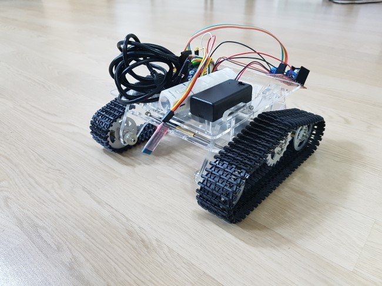

# arduino_dc_rc_car

DC Motor control by Arudino

아슬하다 프로젝트

# 1. 연결도

http://cafe.naver.com/openrt/16023

##L298N 

1, 12V   -   배터리 9V

2, GND  -  GND

3, 5V     -  아두이노 5V

4, ENA  -   10~

5, IN1    -   9~ 

6, IN2    -   8

7, IN3    -   7

8, IN4    -   6~

9, ENB   -   5~

##HC-05        

1, State  -  N.C(연결 안해 도 됨)

2, RXD   -  3~

3, TXD   -  2

4, GND  -  GND

5, VCC   -  아두이노 5V

6, Key    -  N.C(연결 안 해도 됨)

# 2. 동작영상(유튜브)
<https://youtu.be/dnSpAt0VALM>
